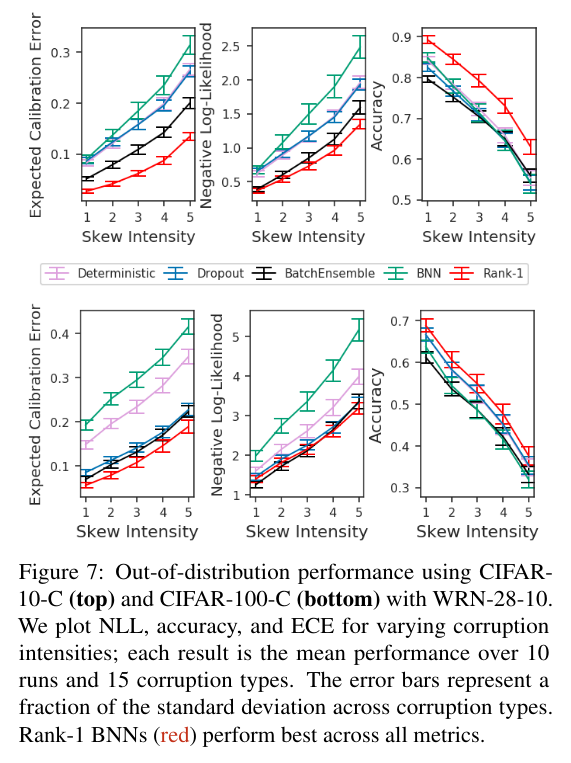

# Efficient and Scalable Bayesian Neural Nets with Rank-1 Factors

## What is the problem

BNN demonstrate:

- robustness

- uncertainty quantification of modern deep learning

But they struggle with;

- **Underfitting at scale**

- **Parameter efficiency**

DNNs suffer from efficiency issues so there needs to be a way to combine the benefits of both.

The problem involves using **rank-1 parameterisation of BNNs, where each weight matrix involves only a distribution on a rank-1 subspace.**

- They also use mixture approximate posteriors to capture multiple modes **(smaller memory footprint)**.

The BNN can have **graceful failure when a model doesn't know what to predict and can generalise better to out of distribution examples.**

### Why does this occur

**They underperform on accuracy and DO NOT SCALE AS WELL compared to simpler baselines.** 

- One of the highlighted reasons for this could be that the **best configurations are still unknown** e.g.  best parameterisation, weight prior, approximate posterior etc.

- The second issue that why this occurs is due to the fact **that maintaining a distribution over weights incurs a significant cost both in THE ADDITIONAL PARAMETERS and RUNTIME COMPLEXITY.**

- You can have much better predictive performance by just running a deterministic model to mathc this parameter count rather than using 5 MCMC samples which requires 5 times the number of weights. 

- ### How to solve this

To solve the **issue of best configurations**:

- Build on ideas of deep ensembles which work by aggregating predictions from multiple randomly initialised SGD-trained models. **These deep ensembles multimodal solutions provide uncertainty benefits that are distinct and complementary compared to single mode distributions.**

[Simple and Scalable Predictive Uncertainty Estimation using Deep Ensembles](https://arxiv.org/pdf/1612.01474.pdf)

[Deep Ensembles: A Loss Landscape Perspective](https://arxiv.org/abs/1912.02757)

To solve the issue of **scalability and cost**:

- The **intrinsic dimensionality** of popular architectures can be on the order of a 100,000.

- Perform ensembling on a rank-1 pertubation of weight matrix **without needing to learn the subspace.**

- Use rank-1 decomposition to **capute most of the variational posterior's variance.**

[Subspace Inference for Bayesian Deep Learning](https://arxiv.org/abs/1907.07504)

To summarise they

- Propose a rank-1 parameterisation of BNN, where each weight matrix involves **only a distribution on a rank-1 subspace.**

- Use of mixture approximate posteriors as a simple strategy for aggregating multimodal weight solutions.

This allows them to:

- leverage **heavy tailed distribution such as Cauchy, without sacrificing predictive performance.**

- mixtures on rank-1 subspace unlike typical ensembles **invovle a significantly reduced dimensionality.**

### Background knowledge

So the rank of a matrix is the dimensions of the vector space spanned by its columns. Spans to a set of maximal number of linearly dependent columns.

Taking a minibatch of size B, we are minimising the loss function of:

In practice Bayesian neural networks often underfit, mired by complexities in both the choice of the prior and approximate posterior as well as stabilising the training dynamics involved by the loss function and additional variance from sampling weights to estimate the log llkelihood. **Even the simplest solution of a fully factorised normal approximation has a 2 times cost**

Deep esembles - **one trains multiple copies of a network and then makes predictions by aggregating the individual models to form a mixed distribution.**

- This comes at a cost of training and predicting with multiple copies of network parameters.

**Batch ensemble - Paper ()**

- Parameter efficient extension that ensembles over a low rank subspace.

- Let ensemble size by $K$
  
  - For each layer denote the original weight matrix $W \in \R^{m \times d}$ which will be shared across ensemble members
  
  - Each member, $k$. owns a tuple of trainable vectors $r_{k}, s_{k}$ of size $m$ and $d$ respectively.

- Batch ensemble then defines $K$ ensemble weights:
  
  - $W_{k}' = W \cdot F_{k}$ where $F_{k} = r_{k}s_{k}^{T}$
  
  - The multiplication between the two $W \cdot F$ is element wise product. 
  
  - Then the forward pass can be written as
  
  - $y = \phi(W_{k}'x) = \phi((W \cdot r_{k}s_{k}^{T})x) = \phi((W(x \cdot s_{k})) \cdot r_{k})$

- In other words the rank 1 vectors correspond to element wise multiplication of input neurons and pre-activations. **This admits efficient vectorisation as we can replace x, r and s with matrices where each row $X \in R^{B \times d}$ is a choice of ensemble member.**

### Rank-1 Bayesian Neural networks

Consider BNN with rank 1 factors, $W' = W \cdot rs^{T}$, we place priors on $W'$ by placing priors on $r, s$ and $W$. Upon observiing data we compute for $r$ and $s$ (**the rank-1 weight distributions.**) while treating $W$ as deterministic.

- Apply variational inference and perform approximate posterior inference **over the rank vectors and point estimate the weights W with maximum likelihood.**

Now the loss function becomes minimising with respect to the rank-1 vectors:

Prior is zero mean normal with fixed S.D, which is equivalent to an L2 penalty.

- enables significant variance reduction

- **weight sampling only comes from the rank-1 variational distributions**rather than over the full weight matrices.

### Priors

The priors over the rank-1 factors are basically heirarchical priors on the weights in a noncentered parameterisation, **(i.e. all distributions on the weights and scale factors are independent).**

- this remvoes posterior correlations between the weights which can be difficult to approximate

Some priors discussed were:

- **hierachy across both input and output neurons** - Gaussian scale mixtures 

- 

- **scale using half-cauchy** - 

Cauchy priors:

- **heavy tailed real-valued priors** are **wealkly informative priors** such as the Cauchy are often preferred for robustness as they concentrate **less probability at the mean thanks to the heaviertails.**
- This allows activation distributions to be further apart at training time **reducing the mismatch when passed out-of distribution inputs.**
- There is alck of empirical success other than for compression tasks. 
- **In non-centered parameterisation REAL-valued scale priors outperform positive valued ones.**
- 

When looking at corruption tasks, the heirarchy of priors across both vectors outperforms the others on all three metrics, suggesting improved generalisation. **They propose the ability to modulate the uncertainty of both the inputs and outputs of each layer assists in handling distribution shift.**

**How to determine components for mixture approximate posterior.**

- As the **number of mixture components increases the batch size B of new data points decreases.**

- 

**Role of non degenerate components:**

- These are distributions that **do not have all probability mass at a single point.**

- Batch ensemble can be interpreted as using a mixture of Dirac delta components (???)

### Posteriors (Mixture or average)

- log-likelihood: mixture or average, when using mixture distributions as the **approximate posterior**, the expected $\log$ likelihood involves an average over **all mixture components.**

- One can get a tight bound using Jensens inequality on the log marginal likelihood

- The log-mixture likelihood is preferred over the average as it **is guaranteed to provide at least as good a bound onthe log marginal.**

## Experiments

Use ImageNet, CIFAR-10, CIFAR-100.

## Related Work

Heirarchical priors and variational approximations

- Rank-1 factors can be interpreted as scale factors that are shared across weight elements.

Variance reduction techniques for variational BNNs

- Sampling with rank-1 factors is very similar to Gaussian local reparameterisation
  https://arxiv.org/abs/1701.05369

Parameter efficient ensembles 

- MC dropout is the most popular efficient ensembling technique **based on Bernoulli noise that deactiviates hidden units during training and testing**, BatchEnsembles uses rank-1 factors

Scaling up BNNs

- Variational Online Gauss mentions scaling up BNNs to ImageNet, which outperform a deterministic baseline in terms of NLL but not accuracy, and using approximately 2 times the number of neural network weights. The three others (Osawaet al., 2019). Cyclical SGMCMC (Zhang et al., 2020) and adaptive thermostat MC (Heek & Kalchbrenner, 2019) outperform a deterministic baseline in terms of NLL and accuracy. 

This paper does not apply strategies such as fixed KL scaling or termpering since it uses a rank-1 BNN.
